  

  <a href="commands/whoami.svg"><code>whoami</code></a> · 
  <a href="commands/skills.svg"><code>skills</code></a> · 
  <a href="commands/experience.svg"><code>experience</code></a> · 
  <a href="commands/projects.svg"><code>projects</code></a> · 
  <a href="commands/repos.svg"><code>repos</code></a> · 
  <a href="commands/education.svg"><code>education</code></a> · 
  <a href="commands/contact.svg"><code>contact</code></a> · 
  <a href="commands/tools.svg"><code>tools</code></a> · 
  <a href="commands/languages.svg"><code>languages</code></a> · 
  <a href="https://gh-jaider.github.io/GH-Jaider/"><code>interactive</code></a>

