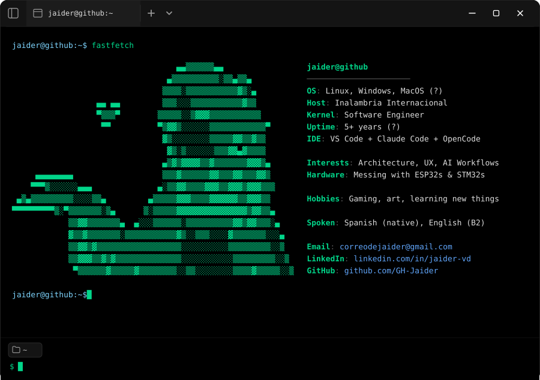

  

<!-- GEN:projects — generated by scripts/generate.mjs from profile.json; edit profile.json instead -->
<pre>
jaider@github:~$ ls ~/projects
<a href="https://github.com/GH-Jaider/foley">foley/</a>                 Go          terminal demos rendered from .tape scripts, no screen capture
<a href="https://github.com/Oktuvida/not-the-louvre">not-the-louvre/</a>        TypeScript  a community art party game: draw, publish, fork, get judged · with <a href="https://github.com/Oktuvida">@Oktuvida</a>
<a href="https://github.com/GH-Jaider/obon">obon/</a>                  Go          the dev servers your agents left on your ports, sent off
<a href="https://github.com/GH-Jaider/karel">karel/</a>                 TypeScript  Karel the Robot: playground, interpreter, grader, VS Code ext
<a href="https://github.com/GH-Jaider/splitify">splitify/</a>              TypeScript  AI-powered commit grouping for VS Code
<a href="https://github.com/GH-Jaider/teletipo">teletipo/</a>              CSS         a terminal UI style that happens to run in a browser
<a href="https://github.com/GH-Jaider/Collisions-Simulator">Collisions-Simulator/</a>  TypeScript  a rigid-body physics lab dressed as a terminal
<a href="https://github.com/GH-Jaider/dcx">dcx/</a>                   Go          TUI that exports .dc.html compositions to video, in parallel
</pre>
<!-- GEN:projects:end -->

  <a href="https://gh-jaider.github.io/GH-Jaider/"><b>▶ Open the interactive terminal</b></a> — it's a real one, type <code>help</code> or <a href="https://gh-jaider.github.io/GH-Jaider/#projects"><code>projects</code></a>

